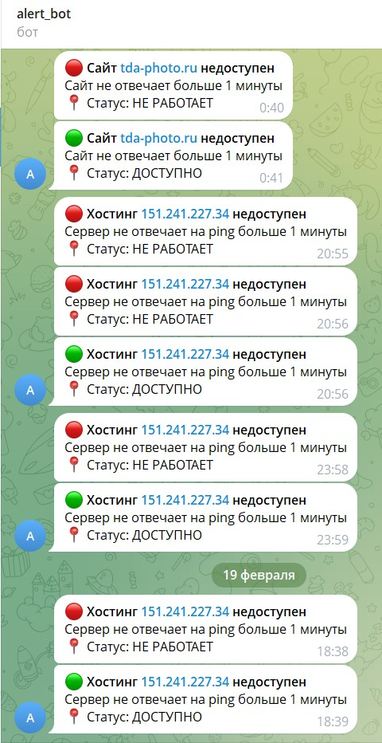
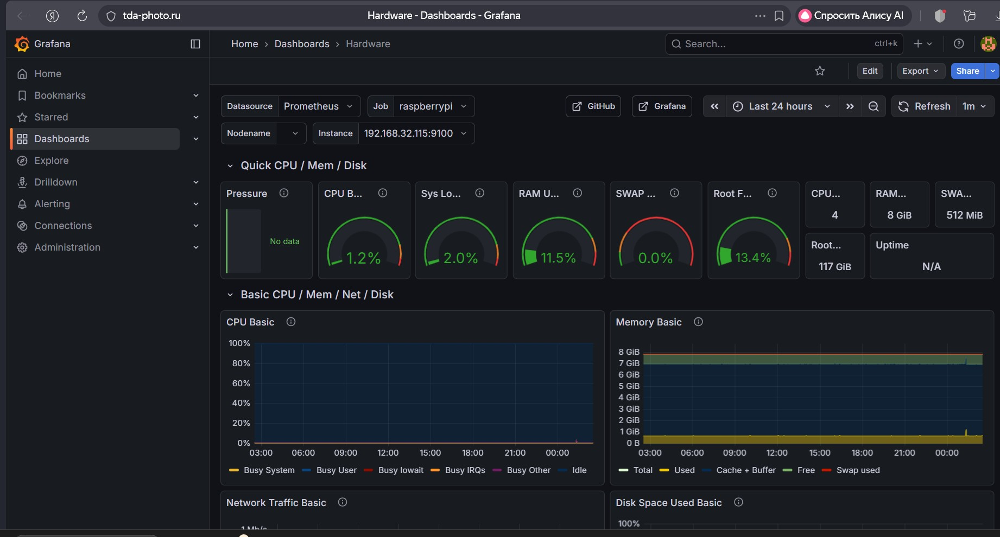

---

# 📝 2️⃣ ALERTING

## О проекте
Полноценная система мониторинга на базе Prometheus + Grafana + Alertmanager для автоматического отслеживания доступности веб-сервисов, состояния серверов и оповещения инженеров о критических событиях через Telegram.

Стек работает 24/7 и мониторит как локальный Raspberry Pi, так и внешний хостинг.

## 🚀 Возможности

### Мониторинг доступности веб-сайтов
- Автоматическая проверка доступности сайтов и callback-URL (Blackbox Exporter)
- Мониторинг HTTP-статусов (200, 4xx, 5xx)
- Отслеживание времени ответа сервера
- Проверка SSL-сертификатов с расчетом оставшихся дней действия

### Системные метрики серверов
**Raspberry Pi 4 (локальный):**
- Загрузка CPU, RAM, SWAP
- Температура процессора (критично для RPi)
- Свободное место на SD-карте
- Сетевой трафик и ошибки

**Внешний хостинг (Hostkey, Ubuntu 24.04):**
- Аналогичный набор метрик
- Мониторинг Docker-контейнеров

### Алертинг в Telegram
- Мгновенные уведомления о проблемах (бот @tda_monitor_bot)
- Автоматическое восстановление (resolved)
- Группировка алертов для предотвращения спама
- Повторные уведомления с интервалом 3 часа
- Статусы **"НЕ РАБОТАЕТ" / "ДОСТУПНО"** на русском языке

### Настроенные алерты
**🔴 Критичные (немедленное реагирование):**
- Сайт недоступен (`tda-photo.ru`)
- Тестер недоступен (`http://172.17**`)
- Хостинг недоступен (`151.241**`)

**🟠 Производительность:**
- Высокая загрузка CPU (>80%)
- Мало места на диске (<10%)
- Высокая температура Raspberry Pi (>75°C)

**🟢 Информационные:**
- SSL-сертификат скоро истекает (за 14 дней)

## 🛠 Технологический стек
- **Prometheus** — сбор и хранение метрик
- **Grafana** — визуализация и дашборды
- **Alertmanager** — управление алертами
- **Blackbox Exporter** — проверка доступности сайтов
- **Node Exporter** — системные метрики
- **Docker + Docker Compose** — контейнеризация
- **Nginx** — reverse proxy для Grafana
- **Telegram Bot API** — уведомления

## Скриншоты

## ⚙️ Быстрый старт
``bash
git clone https://github.com/IOXNSUN/ALERTING.git
cd ALERTING
# Настроить Telegram-бота в config.yml
docker-compose up -d
